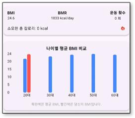

# **SmartFit AI**

### **운동 자세 교정 및 건강 관리 앱**

**SmartFit AI**는 사용자의 운동 자세를 실시간으로 분석하고 교정하는 서비스입니다. 잘못된 운동 자세로 인한 부상을 예방하고, 개인화된 피드백 및 추천 서비스를 제공합니다.

---

## **📋 프로젝트 개요**

- **주제 선정 배경**:
  - 건강에 대한 관심이 증가하면서 올바른 운동 자세의 중요성이 강조되고 있습니다.
  - 잘못된 자세로 인해 부상이 발생할 수 있으며, 이를 예방하기 위해 자세 교정이 필수적입니다.

- **문제 해결**:
  - Google ML Kit 기반의 자세 추적 기술을 활용하여 실시간 자세 분석과 교정을 제공합니다.
  - 운동 과정에서 발생할 수 있는 오류를 줄이고, 개인 맞춤형 피드백을 제공합니다.

---

## **✨ 주요 기능**

### **운동 분석 화면**

### **운동 가이드**

### **운동 기록**

---

## **💡 추가 기능**

1. **체형 관리**  
     
   - BMI, BMR 및 칼로리 데이터를 제공하여 사용자가 체형을 효율적으로 관리할 수 있습니다.

2. **운동 피드백**  
     
   - 유튜브 동영상 및 다양한 가이드를 통해 운동 자세와 기술을 보완할 수 있습니다.

3. **제품 추천**  
   - **의류 추천**  
       
   - **닭가슴살 추천**  
       
   - **추천 상품 보기**  
     

---

## **🛠️ 활용 기술**

- **기술 스택**:
  - **Google ML Kit**:
    - [`google_mlkit_commons`](https://pub.dev/packages/google_mlkit_commons): ML Kit의 공통 유틸리티.
    - [`google_mlkit_pose_detection`](https://pub.dev/packages/google_mlkit_pose_detection): 자세 추적(Pose Detection) 라이브러리.
  - **Flutter**: 멀티플랫폼 앱 개발.
  - **Dart**: 애플리케이션 로직 및 UI 구현.
    
- **Pose Detection 기술**:
  - ML Kit의 Pose Detection을 통해 신체의 관절 포인트를 추적.
  - 정확한 자세와 부정확한 자세를 실시간으로 구분 및 피드백.

