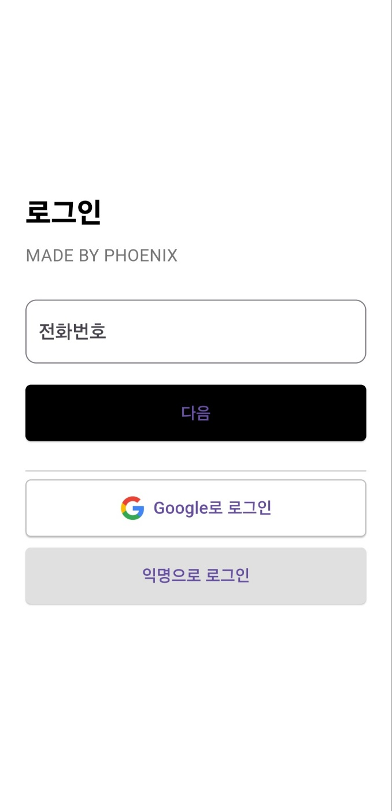
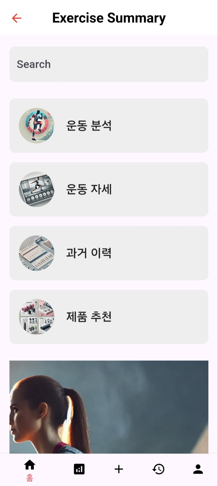
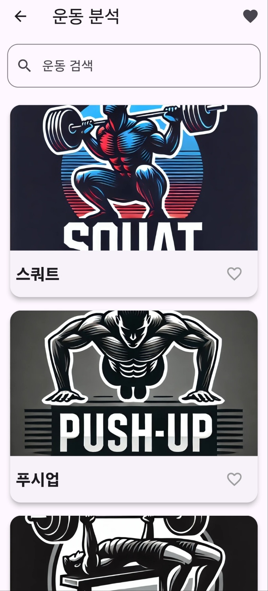
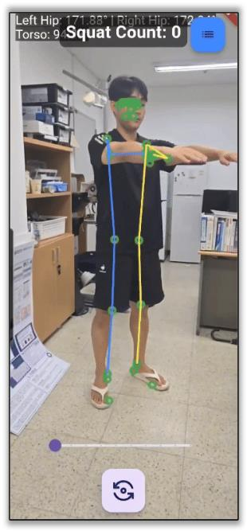
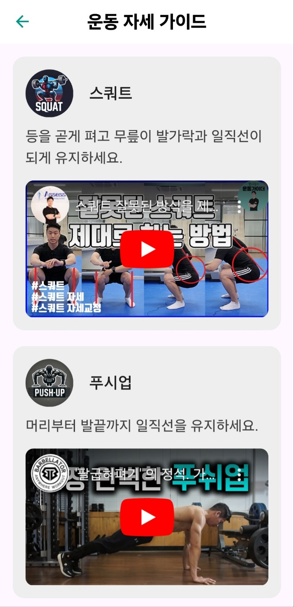
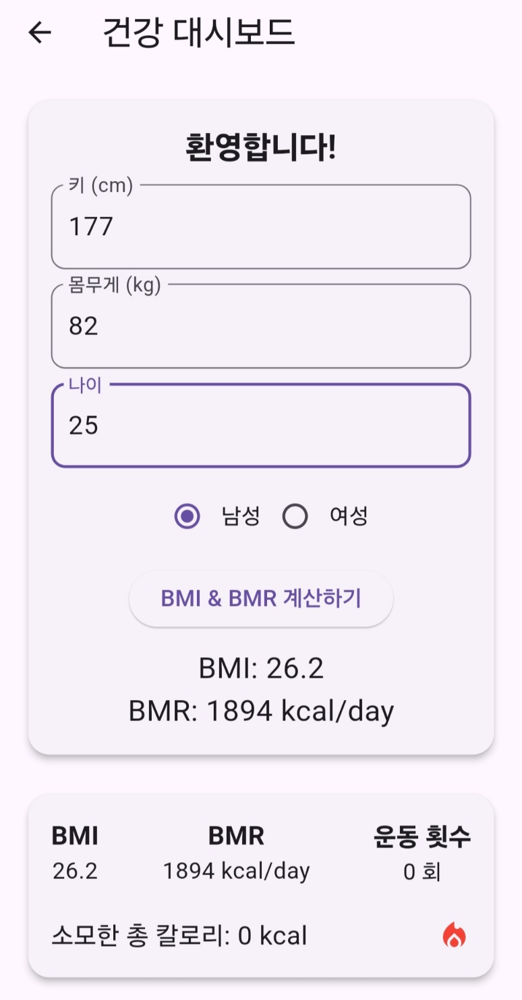
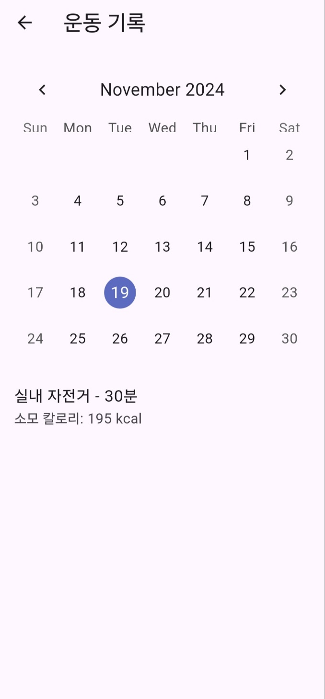
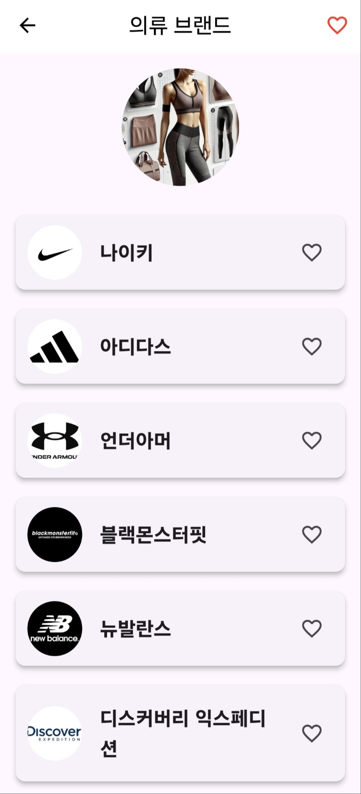
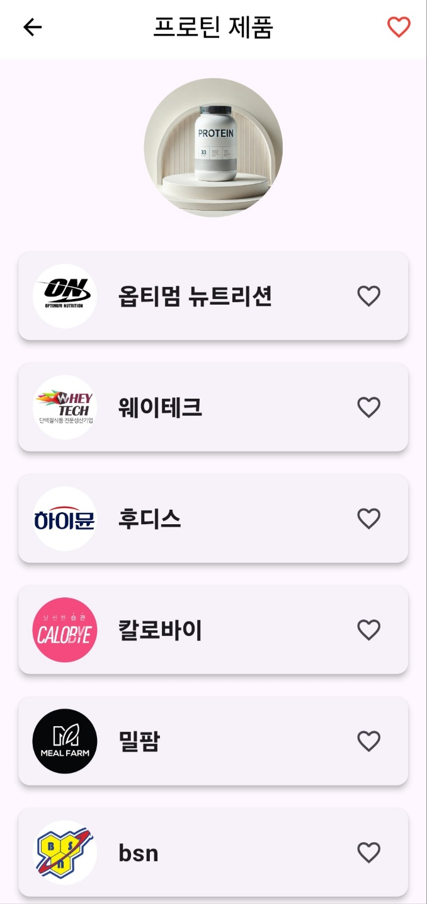
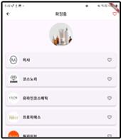

# **SmartFit AI**

### **운동 자세 교정 및 건강 관리 앱**

**SmartFit AI**는 사용자의 운동 자세를 실시간으로 분석하고 교정하는 서비스입니다. 잘못된 운동 자세로 인한 부상을 예방하고, 개인화된 피드백 및 추천 서비스를 제공합니다.

---

## **📋 프로젝트 개요**

- **주제 선정 배경**:
  - 건강에 대한 관심이 증가하면서 올바른 운동 자세의 중요성이 강조되고 있습니다.
  - 잘못된 자세로 인해 부상이 발생할 수 있으며, 이를 예방하기 위해 자세 교정이 필수적입니다.

- **문제 해결**:
  - Google ML Kit 기반의 자세 추적 기술을 활용하여 실시간 자세 분석과 교정을 제공합니다.
  - 운동 과정에서 발생할 수 있는 오류를 줄이고, 개인 맞춤형 피드백을 제공합니다.

---

## **📋 주요 화면**

### **1. 로그인 화면**
사용자가 전화번호, Google 계정 또는 익명 로그인을 통해 손쉽게 접속할 수 있습니다.

---

### **2. 메인 화면**
운동 분석, 운동 자세, 과거 이력, 제품 추천 기능을 한눈에 볼 수 있는 메인 화면입니다.

---

### **3. 운동 분석**
사용자가 다양한 운동을 선택하고 분석할 수 있는 화면입니다. 운동별 데이터와 카운트가 제공됩니다.

#### **운동 분석 세부 화면**
Pose Detection을 통해 사용자의 자세를 실시간으로 추적하여 정확한 운동 수행을 돕습니다.

---

### **4. 운동 자세 가이드**
운동별 올바른 자세를 안내하며, 유튜브 동영상을 활용해 더 나은 이해를 돕습니다.

---

### **5. 건강 대시보드 및 운동 기록**
- **건강 대시보드**: BMI, BMR 등 체형 데이터를 제공하며, 개인화된 건강 지표를 확인할 수 있습니다.
- **운동 기록**: 운동 데이터를 캘린더 형식으로 보여주며, 소모된 칼로리를 확인할 수 있습니다.

---

### **6. 제품 추천**
사용자에게 적합한 다양한 운동 관련 제품을 추천합니다.  
아래는 주요 카테고리입니다:

#### **6.1 의류 브랜드**
스포츠 의류 브랜드를 추천하여 운동 환경을 더 편리하게 만듭니다.

#### **6.2 프로틴 제품**
다양한 프로틴 제품을 추천하여 사용자의 건강 및 운동 목표를 지원합니다.

#### **6.3 닭가슴살 추천**
운동 식단을 고려한 닭가슴살 제품을 추천합니다.

---

## **✨ 주요 기능 요약**

- **운동 분석**: 자세 추적 및 카운트 제공.
- **운동 자세 가이드**: 유튜브 동영상으로 올바른 자세 학습.
- **건강 대시보드**: BMI/BMR 데이터 제공.
- **운동 기록**: 캘린더 기반 운동 이력 관리.
- **제품 추천**: 의류, 프로틴, 닭가슴살 추천.

---

## **🛠️ 활용 기술**

- **기술 스택**:
  - **Google ML Kit**:
    - [`google_mlkit_commons`](https://pub.dev/packages/google_mlkit_commons): ML Kit의 공통 유틸리티.
    - [`google_mlkit_pose_detection`](https://pub.dev/packages/google_mlkit_pose_detection): 자세 추적(Pose Detection) 라이브러리.
  - **Flutter**: 멀티플랫폼 앱 개발.
  - **Dart**: 애플리케이션 로직 및 UI 구현.
    
- **Pose Detection 기술**:
  - ML Kit의 Pose Detection을 통해 신체의 관절 포인트를 추적.
  - 정확한 자세와 부정확한 자세를 실시간으로 구분 및 피드백.

